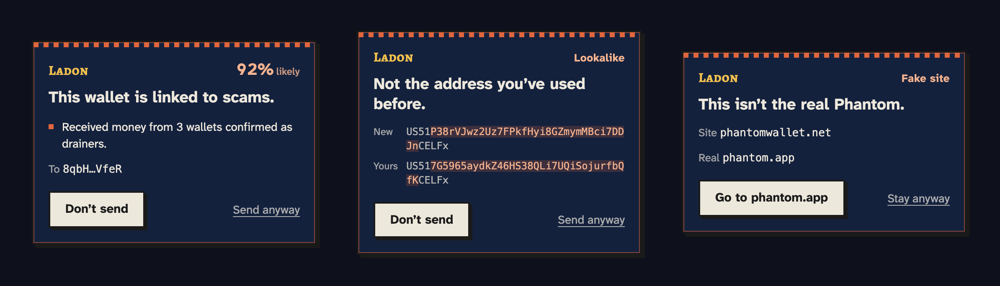
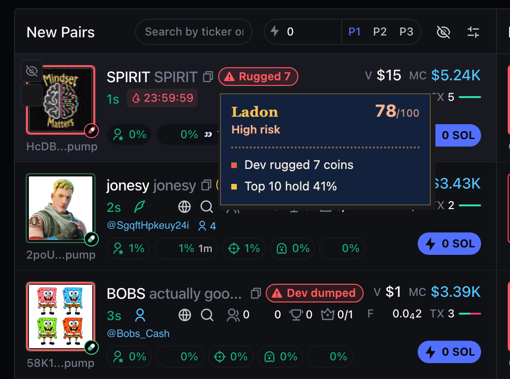

<p align="center">
  
</p>

<h1 align="center">Ladon</h1>

<p align="center"><b>Scam and rug pull protection for Solana.</b><br>
Ladon maps the wallets behind drainers, phishing sites and serial rug pullers,<br>then stops you before you pay one.</p>

<p align="center">Named after the serpent who never slept while guarding the golden apples.</p>

---

## Warnings you can't miss

<p align="center">
  
</p>

Ladon stays quiet until something is wrong. Then it steps in before your wallet even opens.

| Ladon catches | How |
|---|---|
| **Scam wallets** | Ladon reads the transaction a site asks you to sign and checks everyone it pays or hands control to. |
| **Poisoned addresses** | Scammers send you dust from a lookalike of an address you use. Ladon spots the copy and shows you exactly where it differs. |
| **Fake sites** | Known scam domains and sites dressed up as Phantom, Solflare, Jupiter, Raydium, Pump.fun, Solscan or DEX Screener get stopped at the door. |
| **Rugs on Axiom** | Coins on Axiom Pulse get labels like "Rugged 7" or "Dev dumped", with the reasons on hover. |

<p align="center">
  
</p>
<p align="center"><sub>Rug labels right on Axiom Pulse.</sub></p>

Every score is a probability with its reasons, never an accusation. Ladon never signs, blocks or changes anything and never asks for your seed phrase. The choice is always yours.

## How it works

1. **Reports come in.** Victims report the address that took their money. A report alone never flags anyone.
2. **The chain has to agree.** Ladon looks for real evidence in the wallet's history: drainer pulls, money swept out seconds after it lands, liquidity pulled from a token.
3. **Linked wallets get exposed.** Scammers shuffle money between wallets they control. Ladon follows the trail, so one confirmed report can expose a whole ring. Risk fades with every hop, and exchanges never inherit it.
4. **You get warned in time.** Before you sign, you see how likely the wallet is to be a scam and why.

## Try it

**Engine** (Python)

```bash
cd engine
python3 -m venv .venv && .venv/bin/pip install -e ".[dev]"
cp .env.example .env        # add your Helius key
.venv/bin/uvicorn ladon.api:app --env-file .env --reload
```

**Extension** (Chrome)

```bash
cd extension
npm install && cp .env.example .env
npm run build
```

Open `chrome://extensions`, turn on Developer mode, click **Load unpacked** and pick `extension/dist`.

**Website** (Next.js)

```bash
cd web && npm install && npm run dev
```

Tests: `.venv/bin/python -m pytest` in `engine`, `npm test` in `extension`.

## Season 1 Ladon Points

The points page is at `/airdrop`. It records participation in Postgres; it does not create a token or guarantee an allocation.

To deploy it:

1. Set `DATABASE_URL` for the engine. Its startup migration creates the `airdrop_profiles`, `airdrop_events`, and `airdrop_referrals` tables.
2. Set `ALLOWED_ORIGINS` on the engine to include `https://getladon.vercel.app` (and any other site origin that will call it).
3. Set `NEXT_PUBLIC_LADON_API_URL` in Vercel to the public HTTPS base URL of the engine, then redeploy the website.

The API provides `GET /v1/airdrop/profile/{wallet}`, `POST /v1/airdrop/join`, `POST /v1/airdrop/checkin`, `POST /v1/airdrop/wallet-check`, and `GET /v1/airdrop/leaderboard`. Awards are +50 for joining once, +10 for one daily UTC check-in, +5 for up to five unique successful wallet checks per UTC day, and +100/+25 for inviter/invitee on a new referred join. The schema reserves `verified_report` events (+250) for a future private verification workflow; report submission awards no points.

Season 1 currently uses public wallet address entry. It **does not verify ownership**; someone who knows another wallet address can act under it. Treat this as a participation ledger, not as proof of entitlement. Add signed-message ownership verification before attaching financial value to points or using them for any allocation. The write rate limit is currently per API process; use a shared edge rate limit if the engine runs across multiple instances.

## Open API

The scam graph is public, so any wallet, exchange or trading tool can plug in.

| Endpoint | What you get |
|---|---|
| `GET /v1/address/{address}` | A wallet's risk, confidence and reasons. Token accounts are scored as the wallet that owns them. |
| `GET /v1/token/{mint}/risk` | A token's rug risk from its deployer's past, funding links, settings and holders. |
| `GET /v1/phishing/domains` | Known scam domains. |
| `POST /v1/reports` | Report a wallet with `{"address": "...", "description": "..."}`. It starts a check but never flags on its own. |

## Data

- **Exchanges never inherit risk.** `engine/data/exchanges*.txt` holds wallets checked by hand plus every Solana address from OKX's signed proof of reserves. Refresh OKX with `scripts/import_okx_reserves.py` and find new candidates with `scripts/find_exchanges.py --review`.
- **Scam domains** come from Ladon's own list and [Phantom's public blocklist](https://github.com/phantom/blocklist) (MIT). The extension checks them inside your browser, so your browsing never leaves it.
- **False positives are measured.** `scripts/false_positives.py` runs Ladon over big established tokens and their top holders. In the latest run, none of the 10 tokens or 8 wallets it checked were flagged.

## Research

The launch bundle checks follow Hu et al., *MemeTrans: A Dataset for Detecting High-Risk Memecoin Launches on Solana* (arXiv:2602.13480). No data from that dataset is used or shared here.

## Repo

| Folder | What's inside |
|---|---|
| `engine/` | Scam graph engine and public API (Python, FastAPI) |
| `extension/` | Chrome extension (TypeScript) |
| `web/` | Website (Next.js, Tailwind) |
| `shared/` | Address checks and API client used by the site and extension |

Licensed under AGPL 3.0.
